# API PSP

## Nombre del Proyecto
API de PSP para el videojuego de GODOT

## Descripción del Proyecto
Esta API servirá para, de momento, registrar usuarios y logearlos a través de GODOT y en un futura para guardas las puntuaciones de los mismos.
### Documentos y sus Campos

1. **Usuario**

   - `id`: Identificador único del usuario generado automáticamente por MongoDB
   - `username`: Nombre del usuario
   - `password`: Contraseña cifrada

---

## Endpoints de la API

### **Autenticación**

1. **Registro de usuario** (`auth/register`)
   - Permite registrar un nuevo usuario en la aplicación.
   - Recibe username y password.

2. **Login de usuario** (`auth/login`)
   - Permite a los usuarios iniciar sesión.
   - Recibe username y password.
   - La idea es que devuelva un token JWT.

---

## PRUEBAS GESTIÓN USUARIOS

### Registrar un Usuario

- En este caso vamos a registrar un usuario mediante insomnia a nivel local antes de desplegar la API

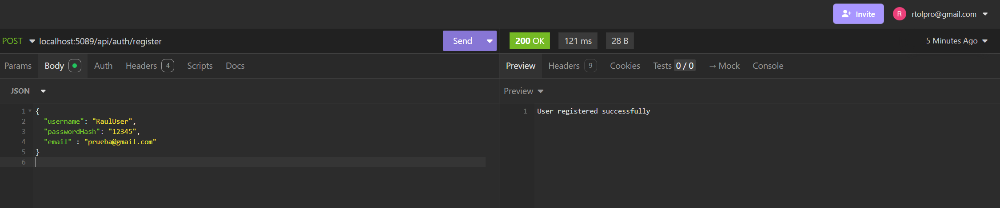

### Logear con un Usuario

- En este caso vamos a logearnos con un usuario a nivel local.

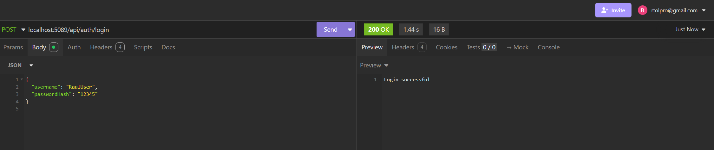

### Aplicación desplegada en Render

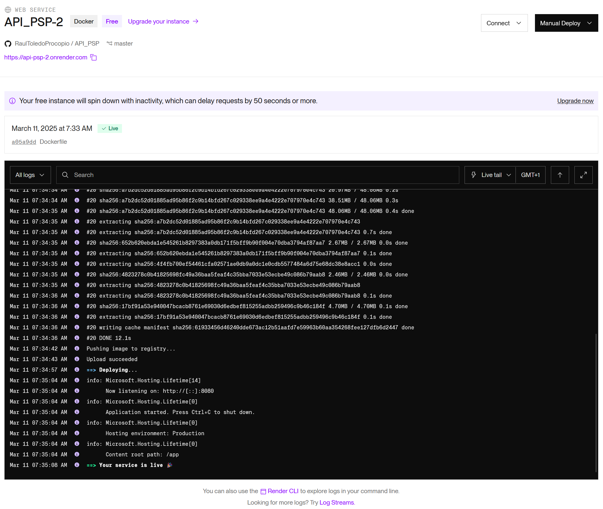

### Registrar un Usuario en Render

- En este caso vamos a registrar un usuario mediante insomnia con la API desplegada

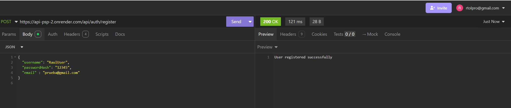
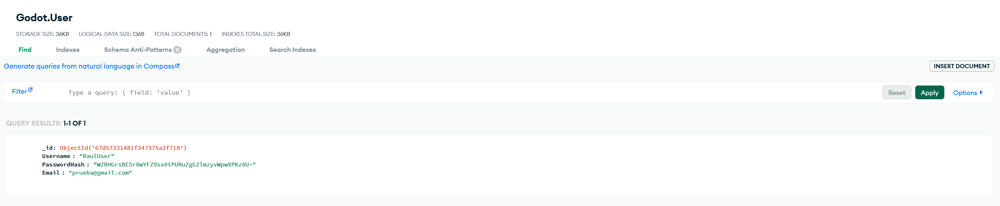

### Logear con un Usuario en Render

- En este caso vamos a logear un usuario mediante insomnia con la API desplegada

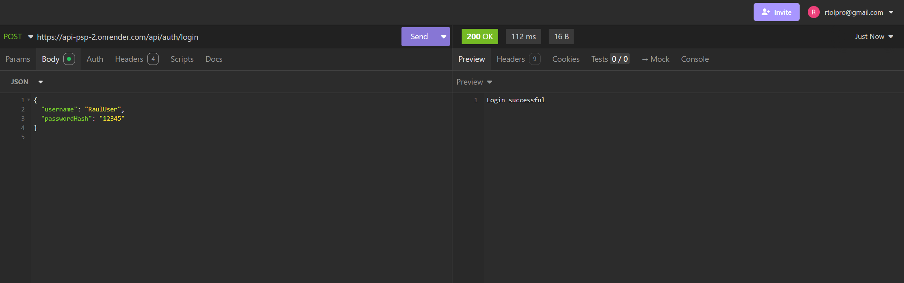

## PRUEBAS EN EL JUEGO

- En este caso hemos creado una pantalla para el login y otra para el registro

### Registrar un Usuario

- Vamos a registrar a un Usuario correctamente

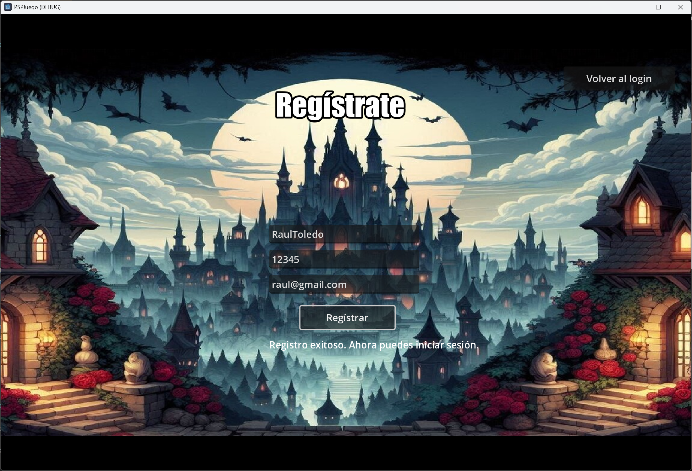
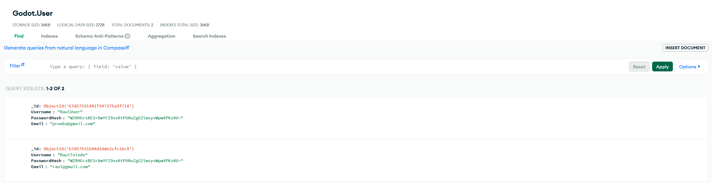

- Vamos a registrar a un Usuario con algún campo vacío

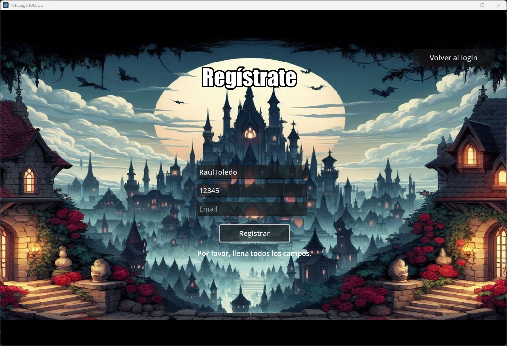

- Vamos a registrar a un Usuario con un Username/email que ya existe

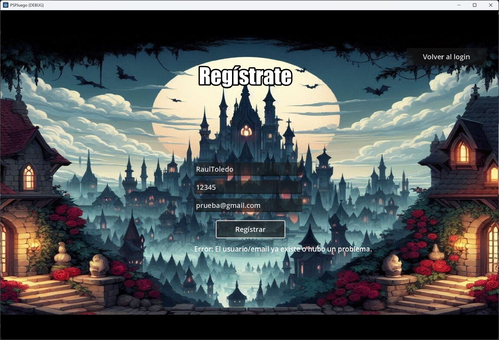

### Logear con un Usuario

- Hemos logeado con un Usuario correctamente, lo que nos lleva al menú del juego.

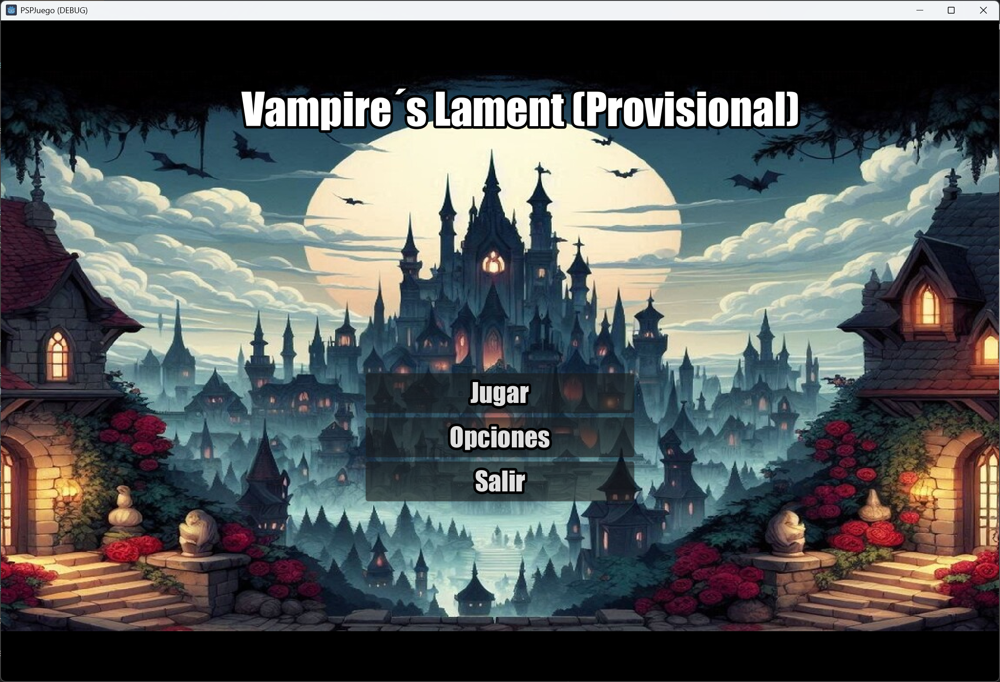

- Vamos a logear con un Usuario vacío o que no exista

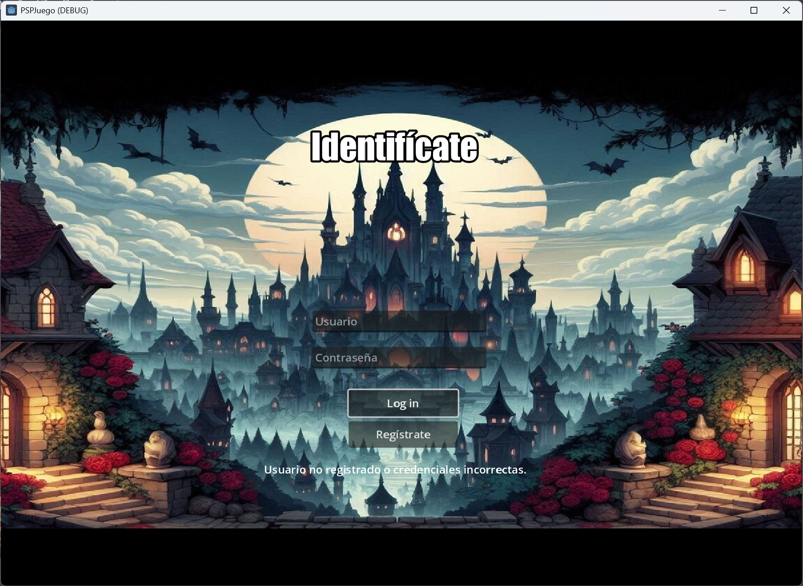
